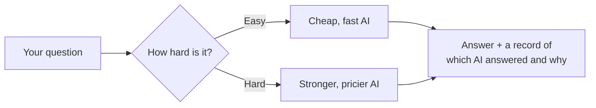
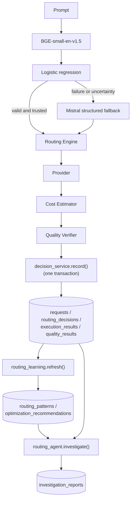
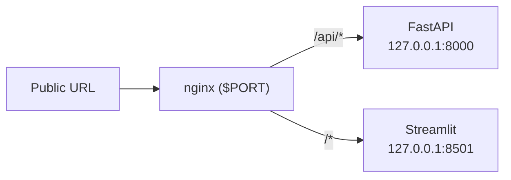

<div align="center">

# Raut IQ

### An explainable, self-auditing multi-LLM routing platform.

**Classifies every prompt, routes it to the cheapest capable model, records a full decision audit trail, learns from historical outcomes, and offline-investigates its own routing history for optimization opportunities — all advisory, all human-approved.**

[](requirements.txt)
[](#license)
[](#testing)

[Live demo](https://d3g44g7pjidyad.cloudfront.net)

[Overview](#overview) • [Architecture](#architecture) • [Features](#features) • [API](#api-overview) • [Running locally](#running-locally) • [Deployment](#deployment) • [Design decisions](#design-decisions) • [Roadmap](#future-roadmap)

</div>

---

## In plain terms

Every AI chatbot call costs money, and most apps send every question — easy
or hard — to the same model. That's like paying a specialist's rate for
every question, even "what time is it?"

Raut IQ reads each question first, sends the easy ones to a cheap
model and the hard ones to a stronger one, and keeps a record of every
choice it made and why. It also reviews its own history over time and
suggests improvements — but never applies one without a person signing
off first.



## Overview

### Problem statement

Most applications that call an LLM pick one model and use it for every
request — a one-line arithmetic question and a multi-step architecture
discussion both hit the same (usually expensive) model. That's simple to
build but wastes money on the majority of prompts that don't need a
frontier model, and it gives you no record of *why* a particular answer
came from a particular model, no way to tell if routing decisions are
actually any good over time, and no mechanism to improve them beyond
manually re-reading logs.

### What Raut IQ does about it

1. **Routes locally first** — BGE-small-en-v1.5 embeds the prompt and a
   persisted logistic regression predicts BASIC, STANDARD, or ADVANCED.
   Invalid, failed, or sub-threshold local results use a structured Mistral
   fallback. If both fail, the request returns an audited error—never a guess.
2. **Explains every decision** — every routed request produces a
   `DecisionCard`: which tier, which provider/model, why, and whether a
   better alternative has been observed historically.
3. **Persists decision intelligence, not just logs** — a normalized
   schema (not one flat log table) makes "how does provider X perform on
   task type Y" a direct query, not a log-scraping exercise.
4. **Learns, but never routes on its own** — a learning layer aggregates
   historical outcomes into patterns and recommendations. Nothing it
   produces is ever applied automatically; a human reviews and, if
   convinced, edits config and bumps a policy version.
5. **Audits itself offline** — a deterministic (no-LLM) investigation
   pipeline periodically reviews routing history for degraded models,
   cost anomalies, and whether existing recommendations still hold up
   against live data — producing a structured, persisted report.

## Architecture

The request path is intentionally small:



One rule holds across every layer above the first line: **nothing
downstream of a routing decision can change how future decisions are
made, except a human editing `routing.yaml`.** See
[Design decisions](#design-decisions).

## Features

- **Low-cost primary classification** — the normal local route has zero
  external classifier API charge; its CPU/memory infrastructure cost is
  measured separately and is not described as free.
- **Controlled semantic fallback** — Mistral via OpenRouter is called only
  when the local router is unavailable, invalid, fails inference, or falls
  below the explicit experimental threshold. There is no runtime heuristic.
- **Evidence-first routing evaluation** — review provenance, family-safe
  splits, routing-risk metrics, and calibration diagnostics stay unavailable
  rather than inventing results when reviewed predictions do not exist.
- **Cost-aware candidate selection** — each tier can define eligible
  candidates with quality, cost, latency, and health policy values; the
  cheapest healthy candidate that clears the quality floor wins.
- **Safe provider fallback** — timeouts, 429s, and server errors can move
  to the next candidate; authentication and malformed requests do not retry.
- **Explainable by construction** — `GET /routing/decision/{id}`
  returns a deterministic, reproducible `DecisionCard`: reasoning steps,
  candidate models, and whether a learned recommendation applies.
- **Real analytics, not a dashboard over a log table** — provider,
  model, and task-type performance, tier distribution, and daily
  cost/latency trends, computed over a normalized schema.
- **Quality verification** — an LLM judge grades BASIC/STANDARD-tier
  answers, feeding pass-rate metrics into every layer above.
- **Learns without auto-applying** — `POST /analytics/refresh`
  recomputes patterns and generates advisory-only recommendations,
  explicitly triggered, never on the request path.
- **Offline optimization agent** — `POST /agent/investigate` runs a
  deterministic, no-LLM pipeline that finds degraded models, cost
  anomalies, and re-validates recommendations against live data.
- **Provider-agnostic** — native Google Gemini plus OpenRouter
  (Mistral, DeepSeek, Qwen, Llama, and more through one gateway); adding
  a provider is one class and one config entry.
- **Config-driven routing policy** — which model serves which tier,
  and learning thresholds, live in `config/routing.yaml`; no redeploy to
  change routing behavior.

The Streamlit UI includes chat, request history, analytics, and read-only
routing settings. The API also exposes the decision, learning, benchmark,
and investigation data directly.

## API overview

| Endpoint | Method | Purpose |
|---|---|---|
| `/chat` | POST | Classify, route, generate, and persist one request |
| `/history` | GET | Paginated past requests |
| `/stats` | GET | Aggregate cost/latency/quality dashboard numbers |
| `/models` | GET | Current routing.yaml/pricing.yaml configuration |
| `/analytics/refresh` | POST | Recompute `routing_patterns` + `optimization_recommendations` |
| `/analytics/routing` | GET | Provider/model/task-type performance, tier distribution, daily trend |
| `/analytics/benchmark` | GET | Stored routing evidence, calibration status, and strategy availability |
| `/analytics/patterns` | GET | Learned routing patterns |
| `/analytics/recommendations` | GET | Advisory optimization recommendations |
| `/routing/decision/{request_id}` | GET | `DecisionCard` + matching recommendation for one past request |
| `/agent/investigate` | POST | Run the offline investigation pipeline, persist a report |
| `/agent/reports` | GET | List investigation report summaries |
| `/agent/report/{report_id}` | GET | Full investigation report |
| `/health` | GET | Liveness check |

Full request/response schemas are in `backend/schemas/*.py` and served
as OpenAPI docs at `/docs` when the server is running.

## Folder structure

```
backend/
  main.py                  # FastAPI app, lifespan, router registration
  database/
    db.py                  # engine/session setup
    models.py               # SQLAlchemy models (all 9 tables, incl. failed_requests)
  routers/                 # thin: validate → call service → return
  schemas/                 # Pydantic request/response contracts
  services/
    local_semantic_router.py # local BGE embeddings + persisted classifier
    classifier_service.py   # local primary → validated Mistral fallback
    routing_engine.py        # deterministic tier → configured provider/model
    quality_verifier.py      # LLM judge for BASIC/STANDARD answers
    decision_service.py       # transactional persistence + DecisionCard reads
    history_service.py / stats_service.py / analytics_service.py  # read-side queries
    routing_learning.py       # pattern/recommendation compute (write-side)
    routing_agent.py          # offline investigation pipeline (write-side)
    investigation_service.py  # investigation report reads
    providers/                # LLMProvider interface + Gemini/OpenRouter adapters
  utils/                    # settings, YAML config loaders, logging
config/
  routing.yaml              # tiers, thresholds, learning config, policy_version
  pricing.yaml               # per-model token pricing
scripts/
  generate_routing_dataset.py # provenance-aware, family-split dataset
  train_local_router.py       # TRAIN-only artifact + checksum metadata
  evaluate_local_router.py    # untouched TEST evaluation
  bootstrap_db.py             # tables, metadata migration, policy seed
frontend/
  streamlit_app.py            # chat / history / stats UI
deploy/
  start.sh                     # launches uvicorn + streamlit + nginx in one container
  nginx.conf.template          # /api/* -> FastAPI, /* -> Streamlit
Dockerfile                    # single image for local Docker and Render
render.yaml                    # Render Blueprint: one web service
tests/                       # offline unit/API/failure/release-gate tests
```

## Running locally

```bash
# 1. Get the project
git clone <this-repo>
cd modelpilot

# 2. Install dependencies
python3.11 -m venv .venv
source .venv/bin/activate
pip install -r requirements.txt

# 3. Add your provider keys and database URL
cp .env.example .env
# open .env and paste in GOOGLE_API_KEY, OPENROUTER_API_KEY, and DATABASE_URL
# (see "Database: Postgres/Supabase" below — SQLite also still works for a
# quick local run, no setup required)

# 4. Create tables + seed the active routing policy (once, or after
#    changing routing.yaml's policy_version)
python -m scripts.bootstrap_db

# 5. Start both services
uvicorn backend.main:app --reload &
streamlit run frontend/streamlit_app.py
```

Open **http://localhost:8501** for the UI, or call the API directly:

```bash
curl -X POST http://localhost:8000/chat \
  -H "Content-Type: application/json" \
  -d '{"prompt": "Explain why the sky is blue."}'
```

```bash
# after a few /chat calls:
curl -X POST http://localhost:8000/analytics/refresh
curl http://localhost:8000/analytics/recommendations
curl -X POST http://localhost:8000/agent/investigate
```

### Database

Runs on Postgres/Supabase in production, SQLite with zero setup locally.

```bash
# .env — pick one
DATABASE_URL=postgresql+psycopg://postgres.<project-ref>:<password>@aws-0-<region>.pooler.supabase.com:5432/postgres
DATABASE_URL=sqlite:///./modelpilot.db
```

```bash
python -m scripts.bootstrap_db    # create tables + seed the active routing_policies row
```

For Supabase, use the **Session pooler** connection string from
**Settings → Database → Connection string**, not the direct host (that
one is IPv6-only). Schema lives entirely in `backend/database/models.py`
— no separate migration framework; `bootstrap_db.py` re-runs are
idempotent. Row Level Security is enabled on every table with zero
permissive policies, since only the backend's direct connection should
ever touch these tables.

### Run with Docker

```bash
docker compose up --build
```

One container, one port (`:8080`) — nginx proxies `/api/*` to FastAPI
and everything else to Streamlit.

## Deployment

Production runs as one ARM64 Docker container on Amazon EC2. CloudFront
is the public HTTPS entry point; the instance pulls the private image from
ECR and reads provider/database settings from SSM Parameter Store.



See `Dockerfile`, `deploy/start.sh`, `deploy/nginx.conf.template`,
and `deploy/aws-user-data.sh` for the exact wiring.

## Testing

```bash
pytest tests/ -v
```

The test suite is offline — provider calls are faked, so no API keys or
network access needed. Covers transactional persistence, the learning
and investigation pipelines, every endpoint's response contract, and
failure paths (provider exceptions, missing config, startup validation).

## Failure handling & startup validation


- Every request gets an audit record, including failures — a
  `failed_requests` row is written before any error response goes out.
- Configuration is validated at startup (`validate_startup_config()`),
  not discovered mid-request — it fails fast with every problem listed
  at once.
- Local and Mistral routing failures produce an audited HTTP 503. The
  removed heuristic classifier is not imported anywhere in the runtime.

## Confidence Is Not Ground Truth

The local classifier's confidence is its maximum logistic-regression class
probability; Mistral confidence is its raw self-assessment. Neither is a
validated probability of correctness. Pydantic proves the normalized decision
shape and range; it does not prove the tier is correct. Empirical correctness requires
comparison with genuinely human-reviewed labels. Calibrated confidence requires
a calibration procedure fitted on validation data and checked on untouched test
data. No such evidence exists yet, so the calibration model is `null` and the
dashboard records the remaining validation limitation.

## v2.1 Routing Validation

```text
Local implementation: PASS
ARM64 Docker validation: PASS
Routing evidence: INCOMPLETE — reviewed-label evidence is unavailable
Release state: PRODUCTION (explicit owner override)
Production routing policy: LOCAL PRIMARY → MISTRAL FALLBACK
```

The local candidate now passes `"What is the capital of France?" → BASIC`
and the other blocking sanity prompts. Its untouched TEST result is 95.74%
accuracy / 95.42% macro-F1 over unreviewed AI-generated labels, so it is
experimental evidence, not a generalization or calibration claim. The owner
explicitly activated production while human review, calibration, quality/cost
ceilings, and a supported routing-risk threshold remain incomplete.

## Design decisions

The main design choices are:

- **Normalized schema over one flat log table** — lets analytics/agent
  queries aggregate by any dimension (task type, provider, tier)
  independently, instead of scanning a denormalized blob.
- **Transactional persistence, no BackgroundTasks** — a request's full
  decision record (all four tables) either exists completely or not at
  all; audit integrity is a correctness requirement, not best-effort.
- **Failures are audited too, in a separate table** — a provider
  exception, a pricing-config gap, or a persistence error each write a
  `failed_requests` row instead of vanishing with no trace; see "Failure
  handling, audit guarantees, and startup validation" above.
- **DecisionCard reconstructed on read, not stored as JSON** — the
  relational columns are the single source of truth; storing a JSON copy
  alongside them would duplicate the same facts with no independent
  value.
- **Recommendations are advisory only, forever** — the routing engine
  has never once read from `routing_patterns` or
  `optimization_recommendations`. Applying a recommendation always means
  a human edits `routing.yaml` and bumps `policy_version`.
- **The optimization agent is deterministic, not an LLM loop** — every
  finding is a reproducible SQL query or threshold comparison; two runs
  against identical data always produce identical findings.
- **`policy_version` on every learned artifact** — patterns and
  recommendations are scoped to the policy that produced them, so a
  routing.yaml change can never silently blend old and new behavior into
  one average.

## Future roadmap

- Collect independently authored, human-reviewed prompts. Benchmark metadata
  intentionally reports zero reviewed rows until that work actually happens.
- Let the optimization agent cite specific `DecisionCard`s as concrete
  examples inside a finding, not just aggregate numbers.
- A lighter-weight approval flow for `optimization_recommendations.status`.
- Multi-tenant/organization scoping — deliberately not built yet; it's a
  large, separately-scoped effort (auth, data isolation, quotas) rather
  than an incremental addition to the routing platform.

## License

MIT — use it, fork it, ship it.
