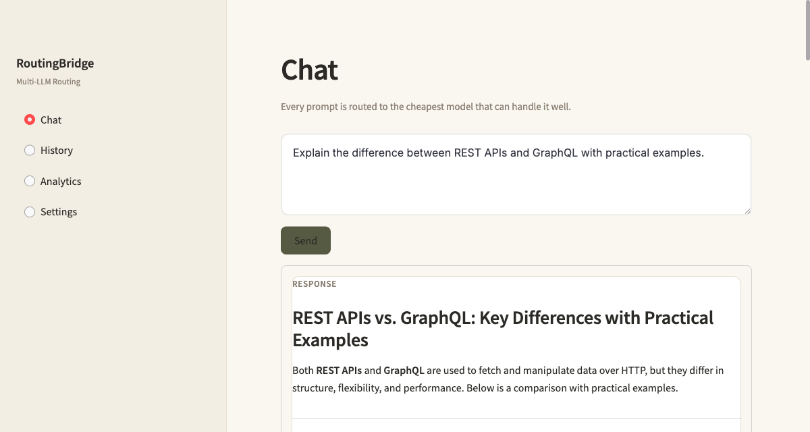
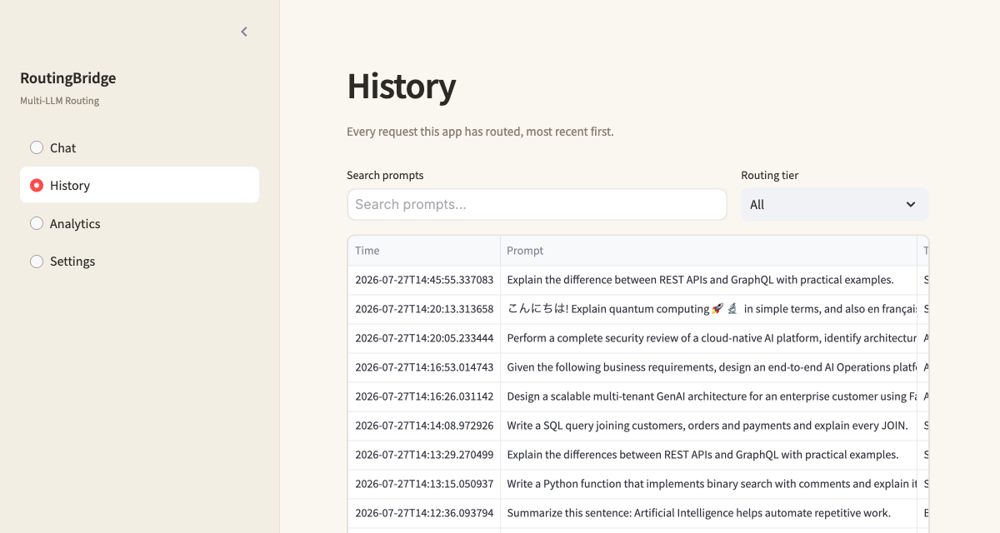
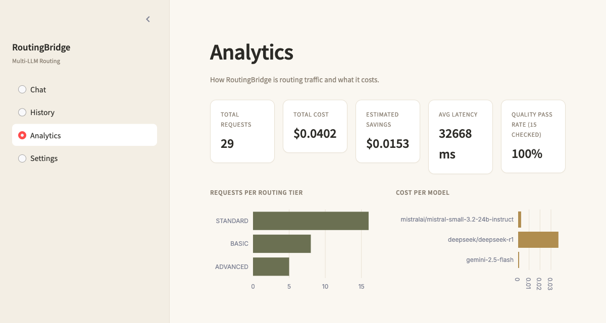
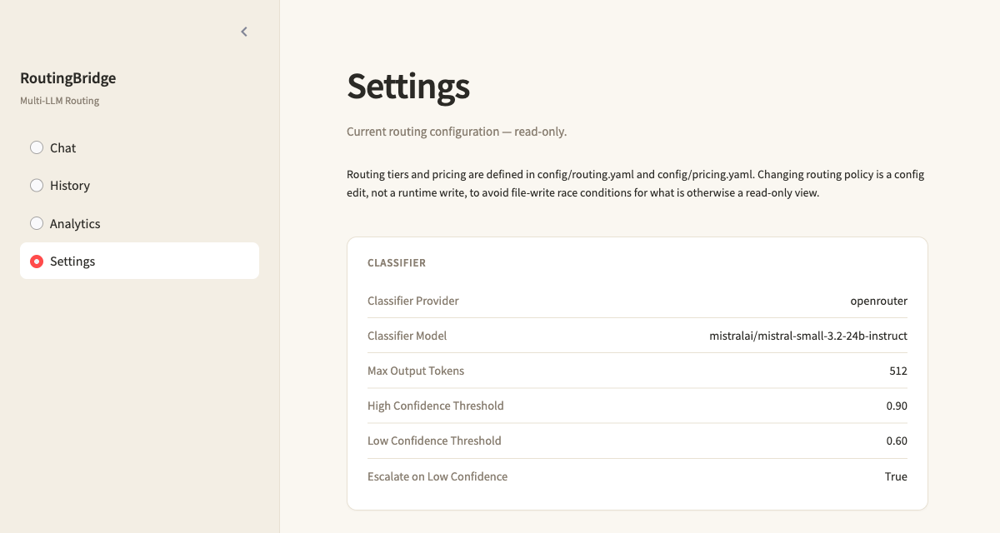

<div align="center">

# RoutingBridge

### An explainable, self-auditing multi-LLM routing platform.

**Classifies every prompt, routes it to the cheapest capable model, records a full decision audit trail, learns from historical outcomes, and offline-investigates its own routing history for optimization opportunities — all advisory, all human-approved.**

[](requirements.txt)
[](#license)
[](#testing)

[Live demo](https://routeiq-5rgn.onrender.com)

[Overview](#overview) • [Architecture](#architecture) • [Features](#features) • [API](#api-overview) • [Running locally](#running-locally) • [Deployment](#deployment) • [Design decisions](#design-decisions) • [Roadmap](#future-roadmap)

</div>

---

## In plain terms

Every AI chatbot call costs money, and most apps send every question — easy
or hard — to the same model. That's like paying a specialist's rate for
every question, even "what time is it?"

RoutingBridge reads each question first, sends the easy ones to a cheap
model and the hard ones to a stronger one, and keeps a record of every
choice it made and why. It also reviews its own history over time and
suggests improvements — but never applies one without a person signing
off first.

## Overview

### Problem statement

Most applications that call an LLM pick one model and use it for every
request — a one-line arithmetic question and a multi-step architecture
discussion both hit the same (usually expensive) model. That's simple to
build but wastes money on the majority of prompts that don't need a
frontier model, and it gives you no record of *why* a particular answer
came from a particular model, no way to tell if routing decisions are
actually any good over time, and no mechanism to improve them beyond
manually re-reading logs.

### What RouteIQ does about it

1. **Routes intelligently** — a cheap classifier judges each prompt's
   difficulty and hands it to the cheapest model that can do it justice,
   escalating automatically when its own confidence is low.
2. **Explains every decision** — every routed request produces a
   `DecisionCard`: which tier, which provider/model, why, and whether a
   better alternative has been observed historically.
3. **Persists decision intelligence, not just logs** — a normalized
   schema (not one flat log table) makes "how does provider X perform on
   task type Y" a direct query, not a log-scraping exercise.
4. **Learns, but never routes on its own** — a learning layer aggregates
   historical outcomes into patterns and recommendations. Nothing it
   produces is ever applied automatically; a human reviews and, if
   convinced, edits config and bumps a policy version.
5. **Audits itself offline** — a deterministic (no-LLM) investigation
   pipeline periodically reviews routing history for degraded models,
   cost anomalies, and whether existing recommendations still hold up
   against live data — producing a structured, persisted report.

## Architecture

Full diagrams (request lifecycle, routing flow, decision flow, analytics
flow, learning flow, agent flow) live in **[`docs/architecture.md`](docs/architecture.md)**.
The short version:

```
Prompt → Classifier → Routing Engine → Provider → Cost Estimator
       → Quality Verifier → decision_service.record() (one transaction)
       → { requests, routing_decisions, execution_results, quality_results }
                                │
                                ▼
       routing_learning.refresh()  →  routing_patterns, optimization_recommendations
                                │                         │
                                ▼                         ▼
       routing_agent.investigate() ←──────────────────────┘
                                │
                                ▼
                     investigation_reports
```

One rule holds across every layer above the first line: **nothing
downstream of a routing decision can change how future decisions are
made, except a human editing `routing.yaml`.** See
[Design decisions](#design-decisions).

## Features

- **Cuts model spend automatically** — simple prompts go to a fast,
  cheap model; hard prompts escalate to a stronger one, with the
  escalation reason attached to the response.
- **LLM-judged difficulty, not keyword rules** — a lightweight
  classifier returns a structured verdict (tier, task type, reasoning
  level, confidence), with a heuristic fallback if the classifier call
  itself fails.
- **Explainable by construction** — `GET /routing/decision/{id}`
  returns a deterministic, reproducible `DecisionCard`: reasoning steps,
  candidate models, and whether a learned recommendation applies.
- **Real analytics, not a dashboard over a log table** — provider,
  model, and task-type performance, tier distribution, and daily
  cost/latency trends, computed over a normalized schema.
- **Quality verification** — an LLM judge grades BASIC/STANDARD-tier
  answers, feeding pass-rate metrics into every layer above.
- **Learns without auto-applying** — `POST /analytics/refresh`
  recomputes patterns and generates advisory-only recommendations,
  explicitly triggered, never on the request path.
- **Offline optimization agent** — `POST /agent/investigate` runs a
  deterministic, no-LLM pipeline that finds degraded models, cost
  anomalies, and re-validates recommendations against live data.
- **Provider-agnostic** — native Google Gemini plus OpenRouter
  (Mistral, DeepSeek, Qwen, Llama, and more through one gateway); adding
  a provider is one class and one config entry.
- **Config-driven routing policy** — which model serves which tier,
  and learning thresholds, live in `config/routing.yaml`; no redeploy to
  change routing behavior.

## Screenshots

**Chat** — routes a prompt, shows the routing decision, cost/latency, and quality verdict:



**History** — every routed request, searchable and filterable by tier:



**Analytics** — aggregate cost, savings, latency, and quality metrics:



**Settings** — the active routing configuration, read-only:



(Analytics/decision/agent *endpoints* are richer than what the UI currently
surfaces — see [Roadmap](#future-roadmap).)

## API overview

| Endpoint | Method | Purpose |
|---|---|---|
| `/chat` | POST | Classify, route, generate, and persist one request |
| `/history` | GET | Paginated past requests |
| `/stats` | GET | Aggregate cost/latency/quality dashboard numbers |
| `/models` | GET | Current routing.yaml/pricing.yaml configuration |
| `/analytics/refresh` | POST | Recompute `routing_patterns` + `optimization_recommendations` |
| `/analytics/routing` | GET | Provider/model/task-type performance, tier distribution, daily trend |
| `/analytics/patterns` | GET | Learned routing patterns |
| `/analytics/recommendations` | GET | Advisory optimization recommendations |
| `/routing/decision/{request_id}` | GET | `DecisionCard` + matching recommendation for one past request |
| `/agent/investigate` | POST | Run the offline investigation pipeline, persist a report |
| `/agent/reports` | GET | List investigation report summaries |
| `/agent/report/{report_id}` | GET | Full investigation report |
| `/health` | GET | Liveness check |

Full request/response schemas are in `backend/schemas/*.py` and served
as OpenAPI docs at `/docs` when the server is running.

## Folder structure

```
backend/
  main.py                  # FastAPI app, lifespan, router registration
  database/
    db.py                  # engine/session setup
    models.py               # SQLAlchemy models (all 9 tables, incl. failed_requests)
  routers/                 # thin: validate → call service → return
  schemas/                 # Pydantic request/response contracts
  services/
    classifier_service.py   # LLM-based routing classifier (+ heuristic fallback)
    routing_engine.py        # tier → provider/model, confidence escalation
    quality_verifier.py      # LLM judge for BASIC/STANDARD answers
    decision_service.py       # transactional persistence + DecisionCard reads
    history_service.py / stats_service.py / analytics_service.py  # read-side queries
    routing_learning.py       # pattern/recommendation compute (write-side)
    routing_agent.py          # offline investigation pipeline (write-side)
    investigation_service.py  # investigation report reads
    providers/                # LLMProvider interface + Gemini/OpenRouter adapters
  utils/                    # settings, YAML config loaders, logging
config/
  routing.yaml              # tiers, thresholds, learning config, policy_version
  pricing.yaml               # per-model token pricing
scripts/
  bootstrap_db.py            # explicit table creation + routing_policies seed (not on app startup)
frontend/
  streamlit_app.py            # chat / history / stats UI
deploy/
  start.sh                     # launches uvicorn + streamlit + nginx in one container
  nginx.conf.template          # /api/* -> FastAPI, /* -> Streamlit
Dockerfile                    # single image for local Docker and Render
render.yaml                    # Render Blueprint: one web service
tests/                       # 57 tests, no network calls required
docs/
  architecture.md             # diagrams + data model, current state
  pr1-4 *.md                   # per-PR design rationale, written as each was built
```

## Running locally

```bash
# 1. Get the project
git clone <this-repo>
cd modelpilot

# 2. Install dependencies
python3.11 -m venv .venv
source .venv/bin/activate
pip install -r requirements.txt

# 3. Add your provider keys and database URL
cp .env.example .env
# open .env and paste in GOOGLE_API_KEY, OPENROUTER_API_KEY, and DATABASE_URL
# (see "Database: Postgres/Supabase" below — SQLite also still works for a
# quick local run, no setup required)

# 4. Create tables + seed the active routing policy (once, or after
#    changing routing.yaml's policy_version)
python -m scripts.bootstrap_db

# 5. Start both services
uvicorn backend.main:app --reload &
streamlit run frontend/streamlit_app.py
```

Open **http://localhost:8501** for the UI, or call the API directly:

```bash
curl -X POST http://localhost:8000/chat \
  -H "Content-Type: application/json" \
  -d '{"prompt": "Explain why the sky is blue."}'
```

```bash
# after a few /chat calls:
curl -X POST http://localhost:8000/analytics/refresh
curl http://localhost:8000/analytics/recommendations
curl -X POST http://localhost:8000/agent/investigate
```

### Database

Runs on Postgres/Supabase in production, SQLite with zero setup locally.

```bash
# .env — pick one
DATABASE_URL=postgresql+psycopg://postgres.<project-ref>:<password>@aws-0-<region>.pooler.supabase.com:5432/postgres
DATABASE_URL=sqlite:///./modelpilot.db
```

```bash
python -m scripts.bootstrap_db    # create tables + seed the active routing_policies row
```

For Supabase, use the **Session pooler** connection string from
**Settings → Database → Connection string**, not the direct host (that
one is IPv6-only). Schema lives entirely in `backend/database/models.py`
— no separate migration framework; `bootstrap_db.py` re-runs are
idempotent. Row Level Security is enabled on every table with zero
permissive policies, since only the backend's direct connection should
ever touch these tables.

### Run with Docker

```bash
docker compose up --build
```

One container, one port (`:8080`) — nginx proxies `/api/*` to FastAPI
and everything else to Streamlit, the same image `render.yaml` deploys.

## Deployment

Runs as a **single Render Web Service** (one container, one Dockerfile)
rather than separate frontend/backend services, so nothing sleeps
waiting on a sibling service to wake up on Render's free tier.

```
Public URL → nginx ($PORT) ─┬─ /api/*  → FastAPI  (127.0.0.1:8000)
                             └─ /*      → Streamlit (127.0.0.1:8501)
```

See `Dockerfile`, `deploy/start.sh`, `deploy/nginx.conf.template`, and
`render.yaml` for the exact wiring.

## Testing

```bash
pytest tests/ -v
```

57 tests, all offline — provider calls are faked, so no API keys or
network access needed. Covers transactional persistence, the learning
and investigation pipelines, every endpoint's response contract, and
failure paths (provider exceptions, missing config, startup validation).

## Failure handling & startup validation

Full detail in `docs/architecture.md`. Short version:

- Every request gets an audit record, including failures — a
  `failed_requests` row is written before any error response goes out.
- Configuration is validated at startup (`validate_startup_config()`),
  not discovered mid-request — it fails fast with every problem listed
  at once.
- The heuristic classifier fallback derives its confidence from the
  configured threshold instead of a hardcoded value that used to
  silently over-escalate.

## Production stabilization notes

A live pass against the real deployed Supabase database caught issues
mocked tests couldn't: a dead-in-production classifier (a missing
`response_format` param made every real call silently fall back to a
heuristic), a Streamlit crash from a bad numpy/pyarrow pairing, a chat
timeout too short for the slowest tier, and RLS disabled on every table.
All fixed and re-verified live — full writeup in
[`docs/production-stabilization.md`](docs/production-stabilization.md).

## Design decisions

The short version of decisions explained at length in `docs/pr*.md`:

- **Normalized schema over one flat log table** — lets analytics/agent
  queries aggregate by any dimension (task type, provider, tier)
  independently, instead of scanning a denormalized blob.
- **Transactional persistence, no BackgroundTasks** — a request's full
  decision record (all four tables) either exists completely or not at
  all; audit integrity is a correctness requirement, not best-effort.
- **Failures are audited too, in a separate table** — a provider
  exception, a pricing-config gap, or a persistence error each write a
  `failed_requests` row instead of vanishing with no trace; see "Failure
  handling, audit guarantees, and startup validation" above.
- **DecisionCard reconstructed on read, not stored as JSON** — the
  relational columns are the single source of truth; storing a JSON copy
  alongside them would duplicate the same facts with no independent
  value.
- **Recommendations are advisory only, forever** — the routing engine
  has never once read from `routing_patterns` or
  `optimization_recommendations`. Applying a recommendation always means
  a human edits `routing.yaml` and bumps `policy_version`.
- **The optimization agent is deterministic, not an LLM loop** — every
  finding is a reproducible SQL query or threshold comparison; two runs
  against identical data always produce identical findings.
- **`policy_version` on every learned artifact** — patterns and
  recommendations are scoped to the policy that produced them, so a
  routing.yaml change can never silently blend old and new behavior into
  one average.

## Future roadmap

- Wire the Streamlit UI to the analytics/decision/agent endpoints
  (currently API-only).
- Let the optimization agent cite specific `DecisionCard`s as concrete
  examples inside a finding, not just aggregate numbers.
- A lighter-weight approval flow for `optimization_recommendations.status`.
- Multi-tenant/organization scoping — deliberately not built yet; it's a
  large, separately-scoped effort (auth, data isolation, quotas) rather
  than an incremental addition to the routing platform.

## License

MIT — use it, fork it, ship it.
