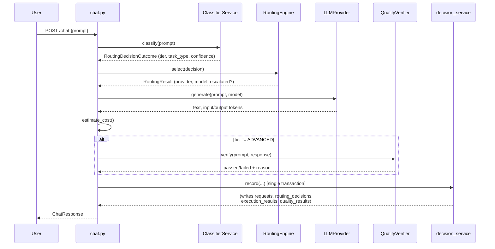
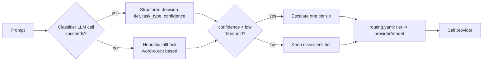
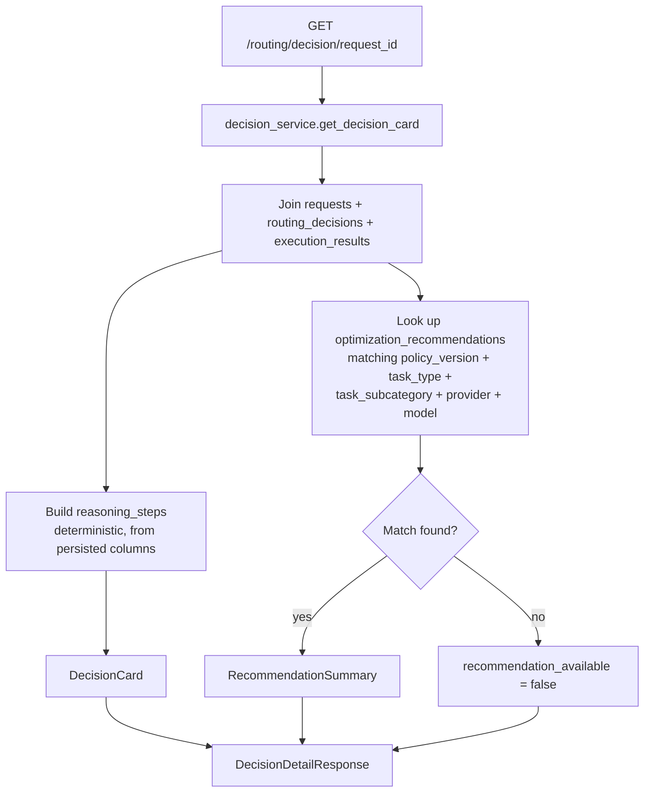
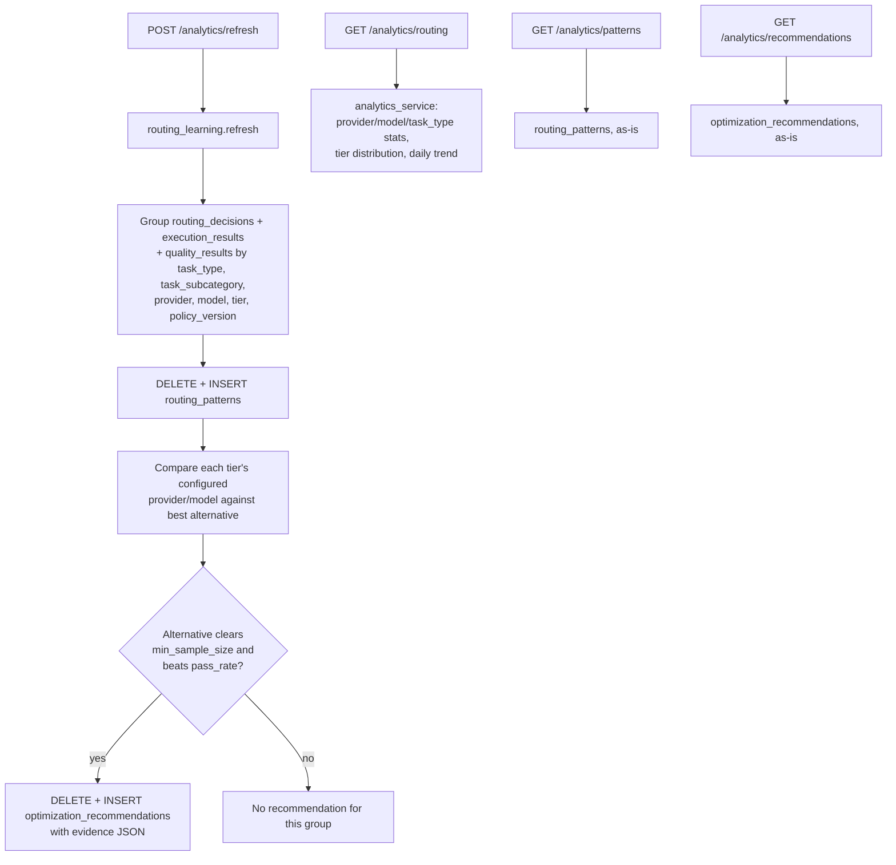
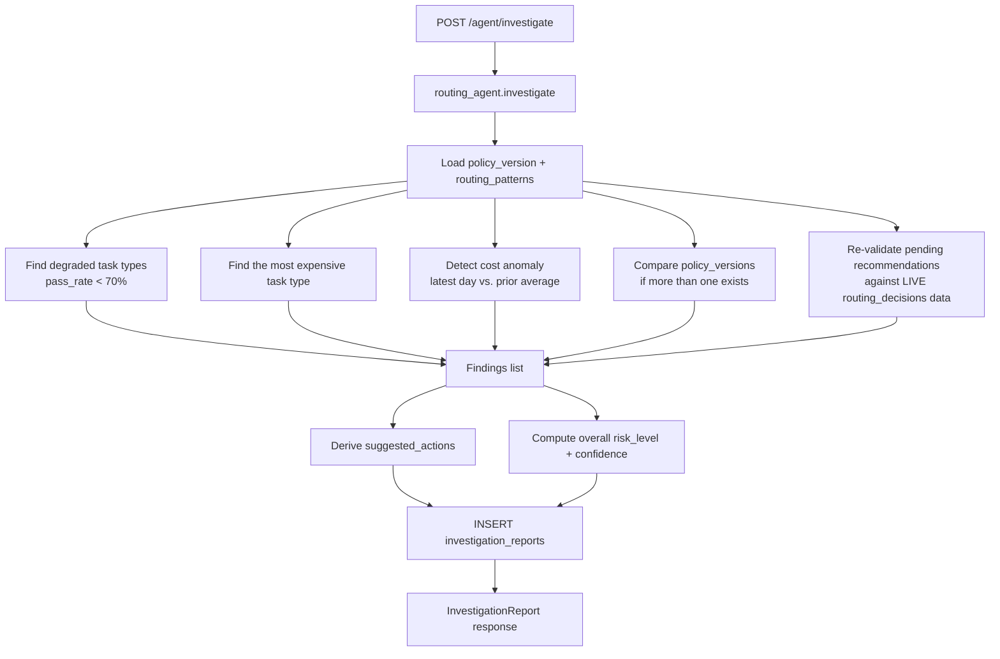

# RouteIQ Architecture

This is the single reference for how the system fits together. The
`docs/pr{1,2,3,4}-*.md` files remain as the detailed *why* behind each
layer's design decisions and trade-offs; this document is the *what* and
*how they connect*, current as of PR5.

## Overall architecture

```mermaid
flowchart TB
    subgraph Client
        UI[Streamlit UI]
        API_CLIENT[Direct API caller]
    end

    subgraph Backend[FastAPI Backend]
        CHAT["/chat"]
        HIST["/history"]
        STATS["/stats"]
        MODELS["/models"]
        ANALYTICS["/analytics/*"]
        DECISIONS["/routing/decision/{id}"]
        AGENT["/agent/*"]
    end

    subgraph Services
        CLASSIFIER[ClassifierService]
        ROUTER[RoutingEngine]
        PROVIDERS[Provider adapters]
        QUALITY[QualityVerifier]
        DECISION_SVC[decision_service]
        HIST_SVC[history_service]
        STATS_SVC[stats_service]
        ANALYTICS_SVC[analytics_service]
        LEARNING[routing_learning]
        AGENT_SVC[routing_agent]
        INVEST_SVC[investigation_service]
    end

    subgraph DB[(SQLite / Postgres)]
        REQ[(requests)]
        RD[(routing_decisions)]
        ER[(execution_results)]
        QR[(quality_results)]
        RP[(routing_patterns)]
        OR[(optimization_recommendations)]
        POL[(routing_policies)]
        IR[(investigation_reports)]
    end

    UI --> CHAT & HIST & STATS & MODELS
    API_CLIENT --> CHAT & ANALYTICS & DECISIONS & AGENT

    CHAT --> CLASSIFIER --> ROUTER --> PROVIDERS
    CHAT --> QUALITY
    CHAT --> DECISION_SVC --> REQ & RD & ER & QR

    HIST --> HIST_SVC --> REQ & RD & ER & QR
    STATS --> STATS_SVC --> RD & ER & QR

    ANALYTICS -->|POST refresh| LEARNING --> RD & ER & QR
    LEARNING --> RP & OR
    ANALYTICS -->|GET routing/patterns/recommendations| ANALYTICS_SVC --> RD & ER & QR & RP & OR

    DECISIONS --> DECISION_SVC

    AGENT -->|POST investigate| AGENT_SVC --> RP & OR & RD & ER & QR
    AGENT_SVC --> IR
    AGENT -->|GET report/reports| INVEST_SVC --> IR

    ROUTER -.reads.-> POL
```

## Request lifecycle (`POST /chat`)



## Routing flow



Routing is entirely deterministic and config-driven — `routing.yaml`'s
`tiers` mapping is the only place a tier resolves to a concrete
provider/model. Nothing from the analytics or agent layers below can
change this at request time (see "Governance" in the README).

## Decision flow (PR3)



## Analytics & learning flow (PR2)



## Optimization Agent flow (PR4)



No LLM call happens in this pipeline — every step is a deterministic SQL
query or comparison. See `docs/pr4-routing-agent.md` for why.

## Governance model (cuts across every flow above)

One rule holds everywhere a "smarter" layer sits on top of routing:

> **Nothing downstream of a routing decision can change how future
> decisions are made, except a human editing `routing.yaml` and bumping
> `policy_version`.**

- `routing_patterns`/`optimization_recommendations` (PR2): generated by
  an explicit `POST /analytics/refresh`, never read by `routing_engine.py`.
- `DecisionCard.recommendation_available` (PR3): surfaces a match, never
  applies it.
- `InvestigationReport.suggested_actions` (PR4): advisory text a human
  reads, never executed.

This is why the routing engine (`backend/services/routing_engine.py`)
has not changed since PR1 — every subsequent PR was additive around it,
never through it.

## Data model summary

| Table | Written by | Read by |
|---|---|---|
| `requests` | `decision_service.record()` | `history_service`, `analytics_service`, `decision_service` |
| `routing_decisions` | `decision_service.record()` | all analytics/agent/decision services |
| `execution_results` | `decision_service.record()` | all analytics/agent/decision services |
| `quality_results` | `decision_service.record()` | `stats_service`, `analytics_service`, `routing_learning`, `routing_agent` |
| `routing_policies` | `scripts/bootstrap_db.py` (explicit, never on app startup) | (audit reference; not yet queried by any endpoint) |
| `routing_patterns` | `routing_learning.refresh()` only | `analytics_service`, `routing_agent` |
| `optimization_recommendations` | `routing_learning.refresh()` only | `analytics_service`, `decision_service`, `routing_agent` |
| `investigation_reports` | `routing_agent.investigate()` only | `investigation_service` |
