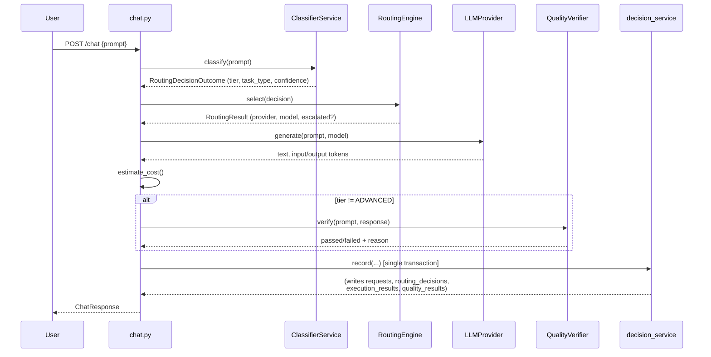
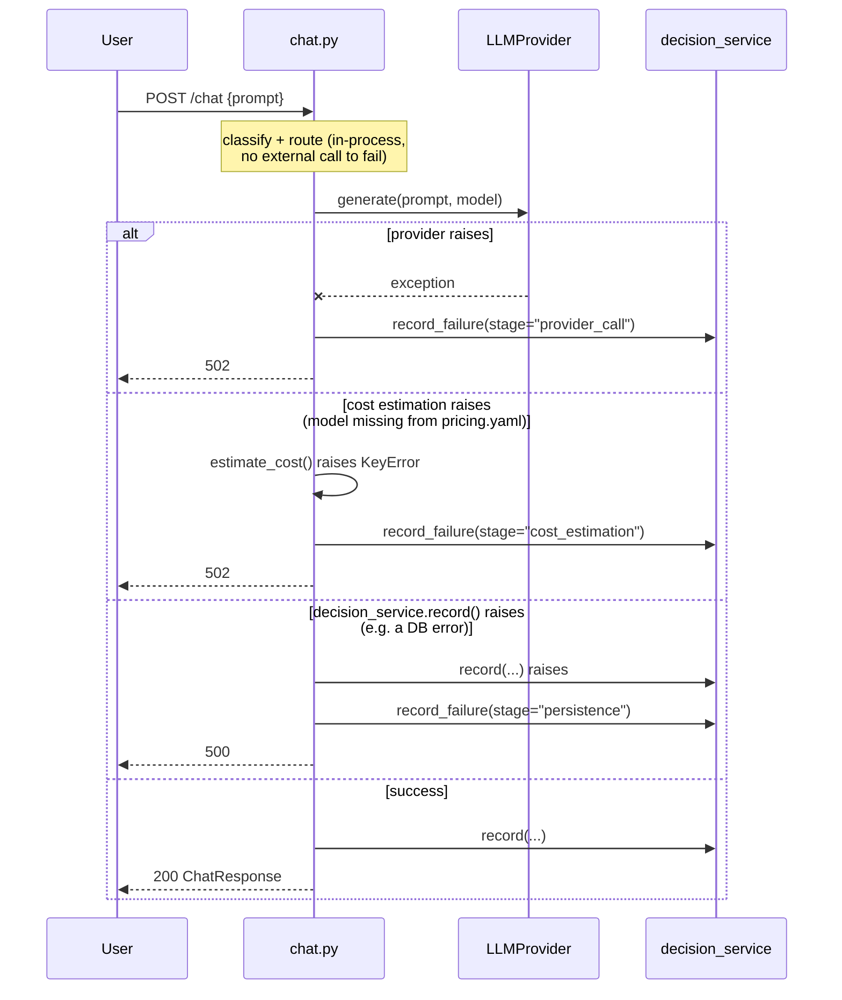
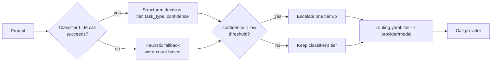
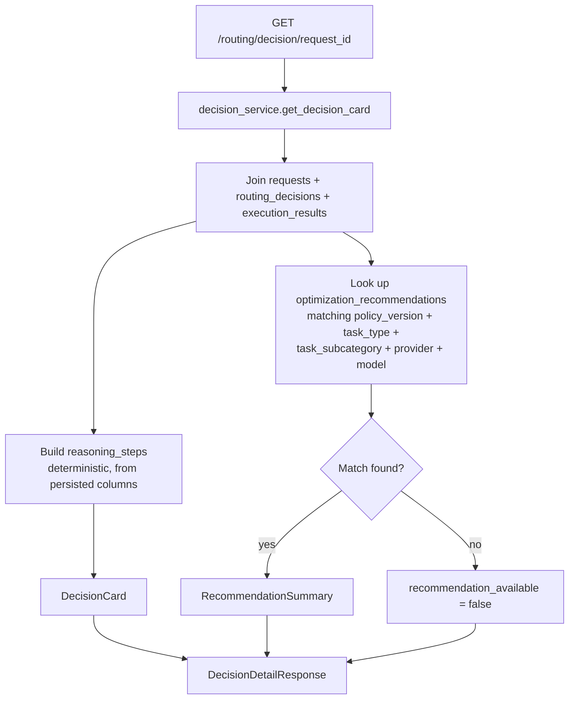
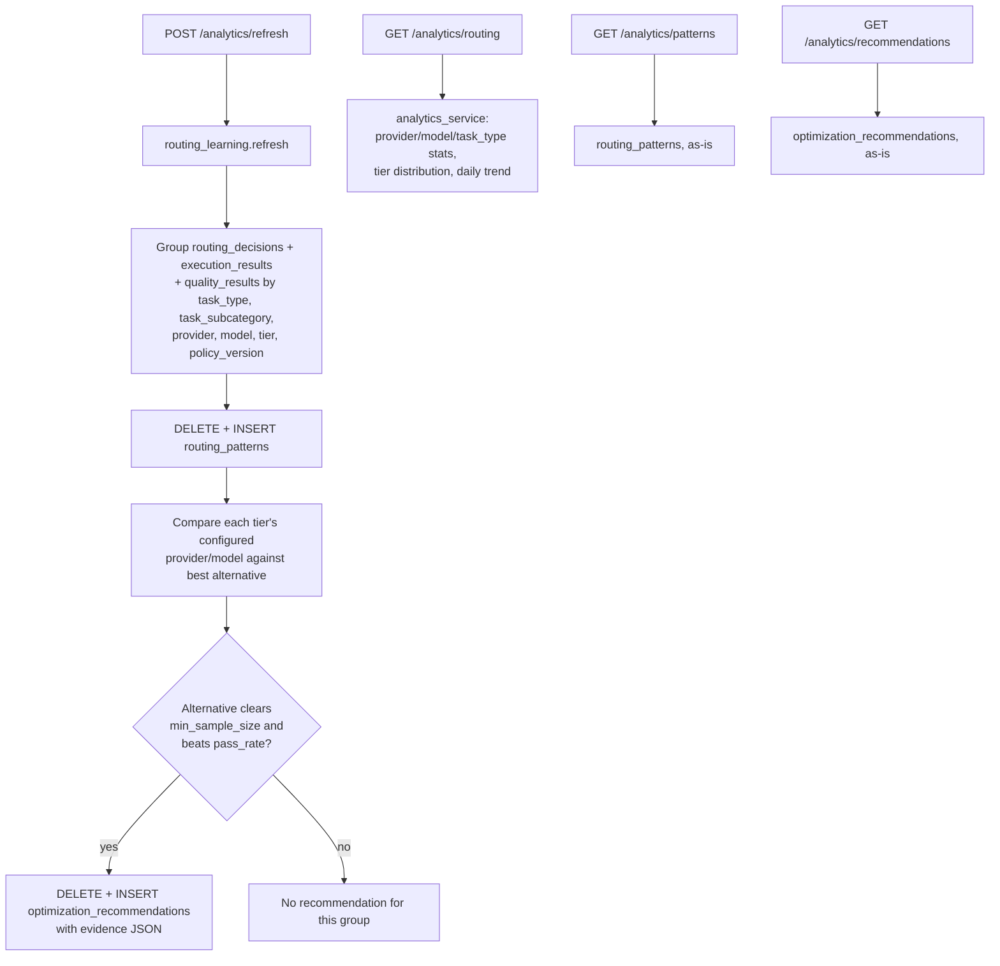
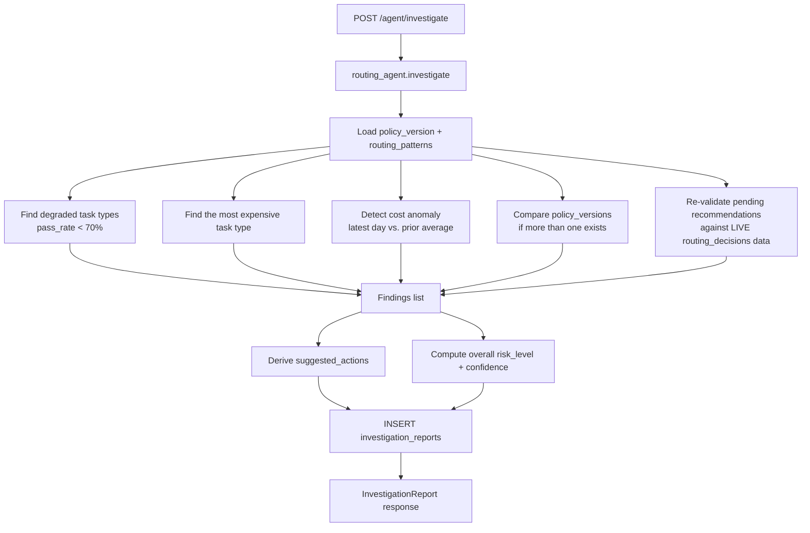

# RouteIQ Architecture

This is the single reference for how the system fits together. The
`docs/pr{1,2,3,4}-*.md` files remain as the detailed *why* behind each
layer's design decisions and trade-offs; this document is the *what* and
*how they connect*, current as of PR5.

## Overall architecture

```mermaid
flowchart TB
    subgraph Client
        UI[Streamlit UI]
        API_CLIENT[Direct API caller]
    end

    subgraph Backend[FastAPI Backend]
        CHAT["/chat"]
        HIST["/history"]
        STATS["/stats"]
        MODELS["/models"]
        ANALYTICS["/analytics/*"]
        DECISIONS["/routing/decision/{id}"]
        AGENT["/agent/*"]
    end

    subgraph Services
        CLASSIFIER[ClassifierService]
        ROUTER[RoutingEngine]
        PROVIDERS[Provider adapters]
        QUALITY[QualityVerifier]
        DECISION_SVC[decision_service]
        HIST_SVC[history_service]
        STATS_SVC[stats_service]
        ANALYTICS_SVC[analytics_service]
        LEARNING[routing_learning]
        AGENT_SVC[routing_agent]
        INVEST_SVC[investigation_service]
    end

    subgraph DB[(SQLite / Postgres)]
        REQ[(requests)]
        RD[(routing_decisions)]
        ER[(execution_results)]
        QR[(quality_results)]
        RP[(routing_patterns)]
        OR[(optimization_recommendations)]
        POL[(routing_policies)]
        IR[(investigation_reports)]
    end

    UI --> CHAT & HIST & STATS & MODELS
    API_CLIENT --> CHAT & ANALYTICS & DECISIONS & AGENT

    CHAT --> CLASSIFIER --> ROUTER --> PROVIDERS
    CHAT --> QUALITY
    CHAT --> DECISION_SVC --> REQ & RD & ER & QR

    HIST --> HIST_SVC --> REQ & RD & ER & QR
    STATS --> STATS_SVC --> RD & ER & QR

    ANALYTICS -->|POST refresh| LEARNING --> RD & ER & QR
    LEARNING --> RP & OR
    ANALYTICS -->|GET routing/patterns/recommendations| ANALYTICS_SVC --> RD & ER & QR & RP & OR

    DECISIONS --> DECISION_SVC

    AGENT -->|POST investigate| AGENT_SVC --> RP & OR & RD & ER & QR
    AGENT_SVC --> IR
    AGENT -->|GET report/reports| INVEST_SVC --> IR

    ROUTER -.reads.-> POL
```

## Request lifecycle (`POST /chat`)



## Failure handling & audit guarantees (PR5 hardening)

Every table `record()` writes (`requests`, `routing_decisions`,
`execution_results`, `quality_results`) has NOT NULL columns that only a
*successful* request produces — a provider's response text, its token
counts, an estimated cost. That's correct for describing successes, but
before this hardening pass it had a silent failure mode: if the provider
call raised, `chat.py` returned a 502 and `record()` was simply never
called. The request vanished — no row anywhere said it had ever happened.
That directly contradicted the project's own audit-integrity principle
(see "Governance" below): an audit trail with a request-shaped hole in it
isn't one.

`failed_requests` closes that hole. It's a separate table, not a
relaxation of the four success tables' constraints, because a failure and
a success genuinely have different shapes: a failure has a `stage` and an
`error_message` and, depending on how far it got, maybe no
provider/model; forcing that into `execution_results`' NOT NULL
`estimated_cost`/`latency_ms` columns would mean inventing placeholder
values for data that was never produced.



Three failure stages are covered, each persisting a `failed_requests` row
with `request_id`, `prompt`, `stage`, `provider`/`model` (whatever was
already known by that point), `error_message`, `status="failed"`, and
`created_at`, before the HTTPException propagates:

- **`provider_call`** — the provider adapter (Gemini or OpenRouter) raised:
  timeout, connection error, rate limit, malformed response, anything.
- **`cost_estimation`** — `estimate_cost()` raised, almost always because
  the routed model has no matching entry in `pricing.yaml` (a config
  mistake — see "Startup configuration validation" below for how this is
  now supposed to be caught *before* it ever reaches a live request).
- **`persistence`** — `decision_service.record()` itself raised (e.g. a
  DB-level error). The session is rolled back before the failure row is
  written, so the two writes don't collide in one broken transaction.

One stage is deliberately *not* wrapped: classification and routing
(`classifier.classify()` / `engine.select()`) are pure in-process logic
with no external call to fail — `classify()` already catches every
exception internally and degrades to the heuristic fallback (see below),
and `engine.select()` only reads `routing.yaml` via a config dict already
validated at startup. An exception surfacing from there is a genuine
programming bug, not a degraded dependency, and is left to raise as an
unhandled 500 rather than being absorbed into an audit row that would
hide it.

`record_failure()` (`backend/services/decision_service.py`) is written to
never itself raise: it rolls back, inserts, commits, and if even that
insert fails, rolls back again and logs at CRITICAL instead of raising —
a broken audit write must never mask the original failure or crash the
error response already being built. That's the one honestly-documented
gap in the guarantee: audit-write failures degrade to a log line, not a
second table row, and that log line is the signal an operator would
alert on.

## Routing flow



Routing is entirely deterministic and config-driven — `routing.yaml`'s
`tiers` mapping is the only place a tier resolves to a concrete
provider/model. Nothing from the analytics or agent layers below can
change this at request time (see "Governance" in the README).

**Heuristic fallback confidence (PR5 hardening fix).** The `E` diamond
above — "confidence < low threshold? escalate" — applies identically
whether the decision came from the real classifier or the heuristic
fallback (`classify_heuristically`, used when the classifier LLM call
fails or returns invalid JSON). That fallback used to hardcode
`confidence=0.5`. `routing.yaml`'s default `confidence_thresholds.low` is
`0.6`, so `0.5 < 0.6` was true on *every* fallback, regardless of which
tier the word count itself had already picked — a 5-word prompt would
land on BASIC by word count, then get silently escalated to STANDARD
anyway, purely because the fixed confidence number happened to sit below
the threshold. That wasn't a documented design choice (the fallback's own
docstring only explains *why* confidence is low, not this interaction),
and it meant every fallback silently cost one tier more than the
heuristic's own logic intended.

Fixed by deriving the fallback's confidence from the configured `low`
threshold instead of a hardcoded number (`backend/services/heuristic_classifier.py`):
it now sits just above `low` (clearing the escalation check, so the
word-count tier is trusted) and stays capped below `high` (so a fallback
decision is still visibly distinguishable from a genuine high-confidence
classifier verdict). See `test_heuristic_fallback_confidence_does_not_force_escalation`
and `test_heuristic_fallback_still_below_high_confidence_threshold` in
`tests/test_failure_paths.py`.

## Startup configuration validation (PR5 hardening)

`routing.yaml` and `pricing.yaml` are hand-edited, decoupled config files
— nothing enforces that every provider/model routing.yaml references
actually has a `pricing.yaml` entry, or that a typo'd provider name
matches one `providers/factory.py` knows about. Before this hardening
pass, a mismatch there only surfaced at request time: the first request
routed to the broken tier would hit `estimate_cost()`'s `KeyError` (now
handled — see "Failure handling" above — but still a live-traffic failure
for what's really a deploy-time mistake).

`backend/utils/startup_validation.py`'s `validate_startup_config()` runs
in `main.py`'s FastAPI `lifespan`, before the app starts serving, and
checks:

- every provider named in `routing.yaml` (classifier + all three tiers)
  is one of the providers `providers/factory.py` actually implements
  (`google`, `openrouter`)
- every model named in `routing.yaml` (classifier + all three tiers) has
  a matching entry in `pricing.yaml` — this is the check that would have
  caught the original motivating gap directly
- all three tiers (`basic`/`standard`/`advanced`) are present and each
  has a positive `max_output_tokens`
- `confidence_thresholds.low < high`, both within `[0, 1]`
- `learning.min_sample_size` is a positive integer and
  `learning.min_confidence` is within `[0, 1]`
- `policy_version` is present

It collects every problem found and raises one `StartupConfigError`
listing all of them, rather than stopping at the first — a real
`.yaml` typo often breaks more than one check at once, and fixing them
one restart at a time is wasted time. On the real `routing.yaml`/
`pricing.yaml` this repo ships, validation passes silently; see
`tests/test_failure_paths.py` for both the passing case and every failure
case (missing pricing entry, unknown provider, inverted thresholds,
missing tier, multiple simultaneous errors).

## Decision flow (PR3)



## Analytics & learning flow (PR2)



## Optimization Agent flow (PR4)



No LLM call happens in this pipeline — every step is a deterministic SQL
query or comparison. See `docs/pr4-routing-agent.md` for why.

## Governance model (cuts across every flow above)

One rule holds everywhere a "smarter" layer sits on top of routing:

> **Nothing downstream of a routing decision can change how future
> decisions are made, except a human editing `routing.yaml` and bumping
> `policy_version`.**

- `routing_patterns`/`optimization_recommendations` (PR2): generated by
  an explicit `POST /analytics/refresh`, never read by `routing_engine.py`.
- `DecisionCard.recommendation_available` (PR3): surfaces a match, never
  applies it.
- `InvestigationReport.suggested_actions` (PR4): advisory text a human
  reads, never executed.

This is why the routing engine (`backend/services/routing_engine.py`)
has not changed since PR1 — every subsequent PR was additive around it,
never through it.

## Data model summary

| Table | Written by | Read by |
|---|---|---|
| `requests` | `decision_service.record()` | `history_service`, `analytics_service`, `decision_service` |
| `routing_decisions` | `decision_service.record()` | all analytics/agent/decision services |
| `execution_results` | `decision_service.record()` | all analytics/agent/decision services |
| `quality_results` | `decision_service.record()` | `stats_service`, `analytics_service`, `routing_learning`, `routing_agent` |
| `routing_policies` | `scripts/bootstrap_db.py` (explicit, never on app startup) | (audit reference; not yet queried by any endpoint) |
| `routing_patterns` | `routing_learning.refresh()` only | `analytics_service`, `routing_agent` |
| `optimization_recommendations` | `routing_learning.refresh()` only | `analytics_service`, `decision_service`, `routing_agent` |
| `investigation_reports` | `routing_agent.investigate()` only | `investigation_service` |
| `failed_requests` | `decision_service.record_failure()`, called from `chat.py`'s exception handlers | (audit reference; not yet queried by any endpoint — see "Future roadmap" in the README) |

Row Level Security is enabled on every table above with zero permissive
policies, denying all access to Supabase's `anon`/`authenticated` roles.
The backend never uses those roles — it connects directly to Postgres as
the `postgres` role via `DATABASE_URL`, which bypasses RLS entirely — so
this is a pure exposure-closing change with no effect on app behavior.
There is no Alembic migration framework anywhere in this repo (see
"Schema is managed by `Base.metadata.create_all()`" in the README); an
orphaned `alembic_version` table was found in the live database from an
earlier, unrelated experiment and has been dropped.
