# RoutingBridge — Backend Architecture

Reverse-engineered from the implementation (not the README). Every diagram
below reflects actual code paths in `backend/`, `frontend/`, `config/`,
`deploy/`, and `scripts/` as of this commit.

> **Note on scope**: this codebase has **no PDF ingestion, no chunking, no
> embeddings, and no vector DB** — there is no such feature anywhere in the
> repo (confirmed by reading every file under `backend/`). The requested
> "PDF Ingestion Flow" section is omitted rather than fabricated. What this
> system actually does is **LLM request routing**: classify a prompt, pick
> the cheapest capable model, call it, verify quality, and record every
> decision for audit/analytics/learning. All diagrams below reflect that.

---

## 1. Complete System Architecture

```mermaid
flowchart TB
    subgraph Client["Client Layer"]
        Browser["Browser"]
    end

    subgraph Frontend["frontend/ — Streamlit (single container process)"]
        ST["streamlit_app.py<br/>Chat / History / Analytics / Settings pages"]
        Theme["theme.py"]
    end

    subgraph Edge["deploy/ — nginx reverse proxy ($PORT)"]
        Nginx["nginx.conf.template<br/>routes /api/* -> FastAPI, /* -> Streamlit"]
    end

    subgraph API["backend/main.py — FastAPI app"]
        Lifespan["lifespan(): validate_startup_config()"]
        Routers["Routers"]
    end

    subgraph RoutersLayer["backend/routers/"]
        ChatR["chat.py — POST /chat"]
        HistR["history.py — GET /history"]
        StatsR["stats.py — GET /stats"]
        ModelsR["models.py — GET /models"]
        AnalyticsR["analytics.py — /analytics/*"]
        DecisionsR["decisions.py — GET /routing/decision/{id}"]
        AgentR["agent.py — /agent/*"]
    end

    subgraph Services["backend/services/"]
        Classifier["classifier_service.py"]
        Heuristic["heuristic_classifier.py"]
        Engine["routing_engine.py"]
        CostEst["cost_estimator.py"]
        QualityV["quality_verifier.py"]
        DecisionSvc["decision_service.py"]
        AnalyticsSvc["analytics_service.py"]
        Learning["routing_learning.py"]
        Agent["routing_agent.py"]
        HistorySvc["history_service.py"]
        StatsSvc["stats_service.py"]
        InvestigationSvc["investigation_service.py"]
        QueryHelpers["query_helpers.py"]
    end

    subgraph Providers["backend/services/providers/"]
        Factory["factory.py"]
        Base["base.py — LLMProvider ABC"]
        Gemini["gemini_provider.py"]
        OpenRouter["openrouter_provider.py"]
    end

    subgraph Config["config/ + backend/utils/"]
        RoutingYaml["routing.yaml"]
        PricingYaml["pricing.yaml"]
        YamlLoader["yaml_config.py"]
        Settings["utils/config.py — Settings (.env)"]
        StartupVal["utils/startup_validation.py"]
    end

    subgraph DB["backend/database/ — SQLAlchemy ORM"]
        DbEngine["db.py — engine/session"]
        Models["models.py — 9 tables"]
        Postgres[("Postgres/Supabase<br/>or SQLite (local)")]
    end

    subgraph External["External LLM Providers"]
        GoogleAPI["Google Generative AI API<br/>(Gemini)"]
        OpenRouterAPI["OpenRouter API<br/>(Mistral / DeepSeek / Qwen / Llama)"]
    end

    Browser -->|HTTP| Nginx
    Nginx -->|"/api/*"| API
    Nginx -->|"/*"| ST
    ST -->|httpx to /api/*| Nginx
    ST --- Theme

    API --> Lifespan
    Lifespan --> StartupVal
    API --> Routers --> RoutersLayer

    ChatR --> Classifier
    ChatR --> Engine
    ChatR --> Factory
    ChatR --> CostEst
    ChatR --> QualityV
    ChatR --> DecisionSvc

    HistR --> HistorySvc
    StatsR --> StatsSvc
    ModelsR --> YamlLoader
    AnalyticsR --> AnalyticsSvc
    AnalyticsR --> Learning
    DecisionsR --> DecisionSvc
    AgentR --> Agent
    AgentR --> InvestigationSvc

    Classifier --> Heuristic
    Classifier --> Factory
    Classifier --> CostEst
    QualityV --> Factory
    Engine --> YamlLoader
    Classifier --> YamlLoader
    QualityV --> YamlLoader
    CostEst --> YamlLoader
    Learning --> YamlLoader
    Agent --> YamlLoader

    Factory --> Base
    Factory --> Gemini
    Factory --> OpenRouter
    Gemini --> GoogleAPI
    OpenRouter --> OpenRouterAPI

    YamlLoader --> RoutingYaml
    YamlLoader --> PricingYaml
    StartupVal --> RoutingYaml
    StartupVal --> PricingYaml
    Settings -.env vars.-> Classifier
    Settings -.env vars.-> Factory
    Settings -.env vars.-> DbEngine

    DecisionSvc --> Models
    AnalyticsSvc --> Models
    Learning --> Models
    Agent --> Models
    HistorySvc --> Models
    StatsSvc --> Models
    InvestigationSvc --> Models
    QueryHelpers -.shared SQL expr.-> AnalyticsSvc
    QueryHelpers -.shared SQL expr.-> Learning
    QueryHelpers -.shared SQL expr.-> Agent

    Models --> DbEngine --> Postgres
```

---

## 2. Project Directory Architecture

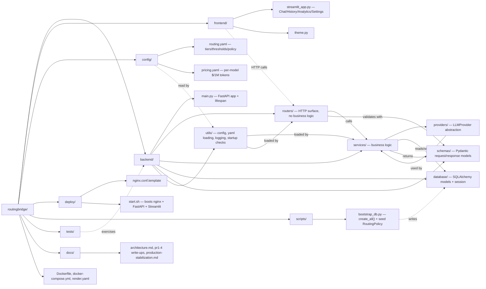

---

## 3. Chat Request Flow (the core, and only, ingestion path)

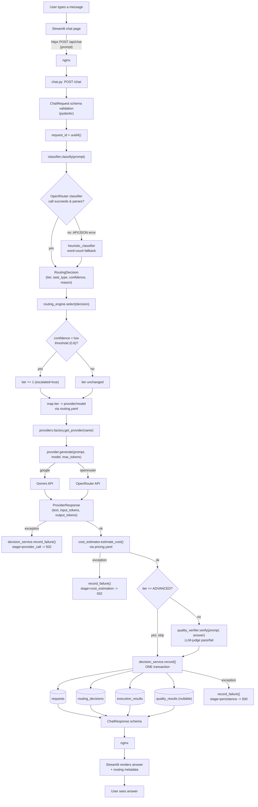

---

## 4. Routing Engine Internal Flow

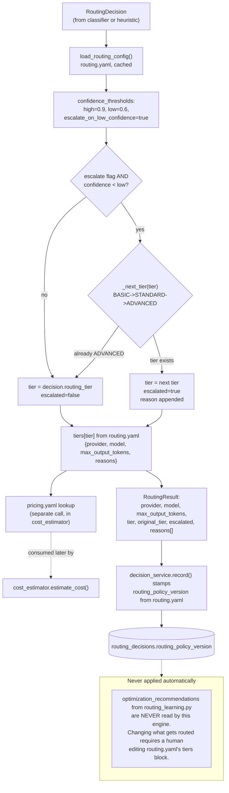

---

## 5. Database Architecture (ER Diagram)

```mermaid
erDiagram
    REQUESTS ||--|| ROUTING_DECISIONS : "1:1 by request_id"
    REQUESTS ||--|| EXECUTION_RESULTS : "1:1 by request_id"
    REQUESTS ||--o| QUALITY_RESULTS : "1:1 optional (skipped for ADVANCED tier)"
    ROUTING_POLICIES ||--o{ ROUTING_DECISIONS : "policy_version referenced (no FK)"
    ROUTING_PATTERNS ||--o{ OPTIMIZATION_RECOMMENDATIONS : "matched by (task_type,tier,provider,model,policy_version), no FK"
    OPTIMIZATION_RECOMMENDATIONS ||--o| ROUTING_DECISIONS : "looked up at read time by attribute match, no FK"

    REQUESTS {
        string request_id PK
        string prompt
        string response
        string normalized_prompt
        string prompt_hash "indexed"
        datetime created_at
    }
    ROUTING_DECISIONS {
        string request_id PK_FK
        string classifier_tier
        string final_tier
        float classifier_confidence
        string task_type
        string task_subcategory "nullable"
        string classifier_reasoning
        string routing_reasoning
        string selected_provider
        string selected_model
        string routing_policy_version
        string escalation_reason "nullable"
    }
    EXECUTION_RESULTS {
        string request_id PK_FK
        bool provider_success
        float latency_ms
        int input_tokens
        int output_tokens
        float estimated_cost
        string error_message "nullable"
    }
    QUALITY_RESULTS {
        string request_id PK_FK
        bool verdict
        float quality_score "nullable, unused"
        string verifier_reasoning
        datetime verified_at
    }
    FAILED_REQUESTS {
        string request_id PK
        string prompt
        string stage
        string provider "nullable"
        string model "nullable"
        string error_message
        string status
        datetime created_at
    }
    ROUTING_POLICIES {
        string version PK
        json config
        bool is_active
        datetime created_at
    }
    ROUTING_PATTERNS {
        int id PK
        string task_type
        string task_subcategory "nullable"
        string provider
        string model
        string tier
        string policy_version
        int sample_size
        float average_cost
        float average_latency
        float pass_rate "nullable"
        float failure_rate "nullable"
        datetime last_updated
    }
    OPTIMIZATION_RECOMMENDATIONS {
        string recommendation_id PK
        string task_type
        string task_subcategory "nullable"
        string policy_version
        string current_provider
        string recommended_provider
        string current_model
        string recommended_model
        float expected_cost_change
        float expected_quality_change
        float confidence
        string reason
        json evidence
        string status
        datetime created_at
    }
    INVESTIGATION_REPORTS {
        string report_id PK
        datetime created_at
        string policy_version
        string executive_summary
        string risk_level
        float confidence
        json findings
        json suggested_actions
        json investigation_steps
        json tools_used
    }
```

**Notes derived from the code, not assumed:**
- `requests → {routing_decisions, execution_results, quality_results}` are only *column-level* `ForeignKey`s — no ORM `relationship()`. `decision_service.record()` calls `db.flush()` after inserting `Request` specifically because Postgres enforces the FK and SQLite (dev) silently didn't (see comment in `decision_service.py`).
- `routing_patterns` and `optimization_recommendations` are **wholesale delete+reinsert** on every `routing_learning.refresh()` — no update-in-place, no history retained.
- `optimization_recommendations` is matched to a `routing_decisions` row at **read time** in `decision_service.get_decision_card()` by exact attribute equality (`policy_version`, `task_type`, `task_subcategory`, `current_provider`/`model`), not a foreign key.

---

## 6. Request Lifecycle (Sequence Diagram)

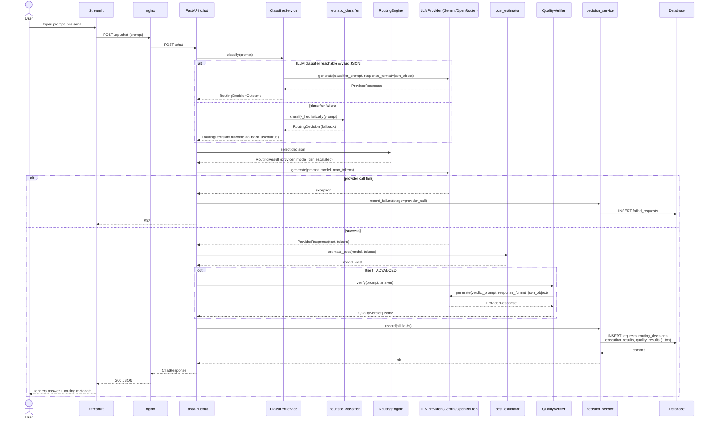

---

## 7. Component Dependency Graph

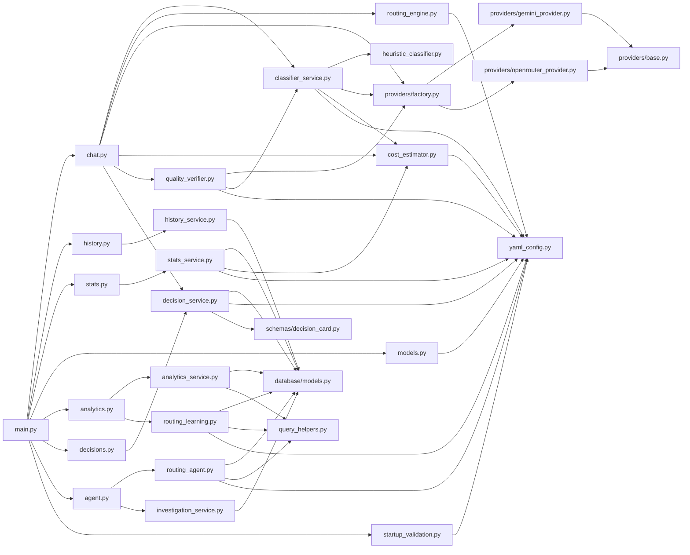

---

## 8. Class Diagram

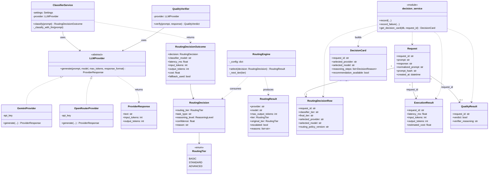

---

## 9. Provider Architecture

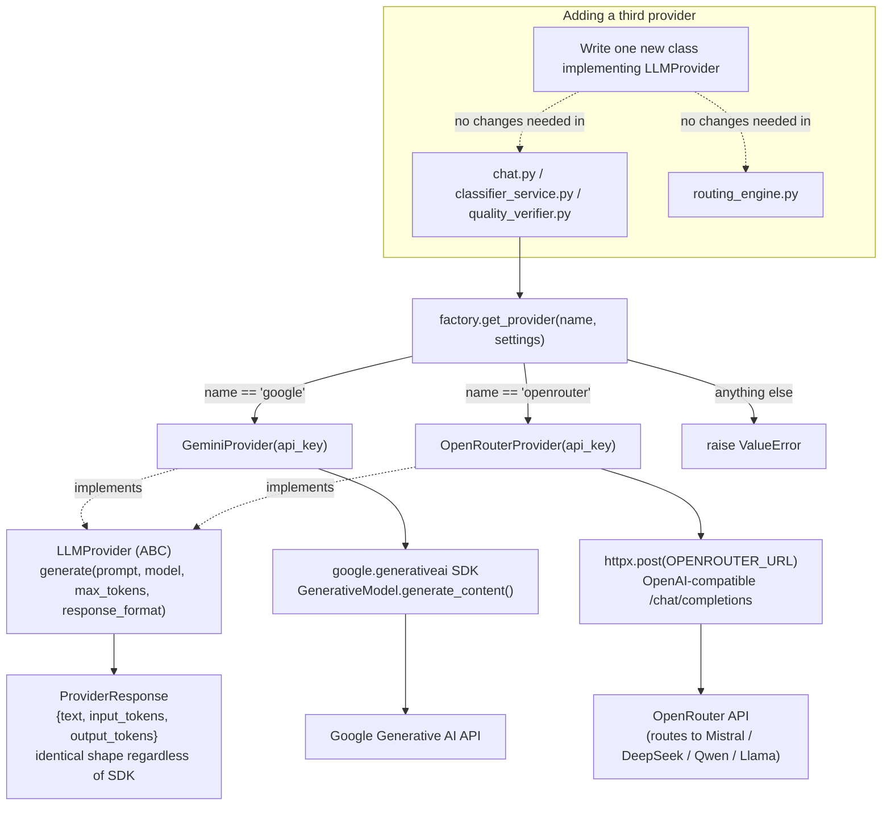

---

## 10. Configuration Flow

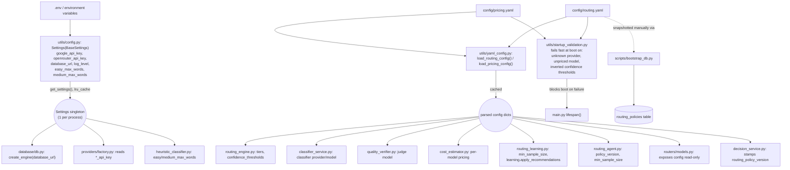

`policy_version` inside `routing.yaml` is bumped by hand whenever tiers/thresholds change; it is the join key between a routing decision and the exact policy that produced it.

---

## 11. Analytics Pipeline

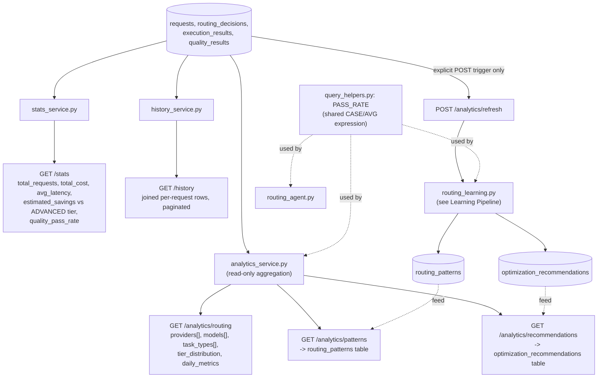

---

## 12. Learning Pipeline (`routing_learning.refresh()`)

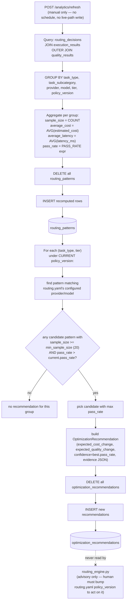

---

## 13. Decision Card Generation

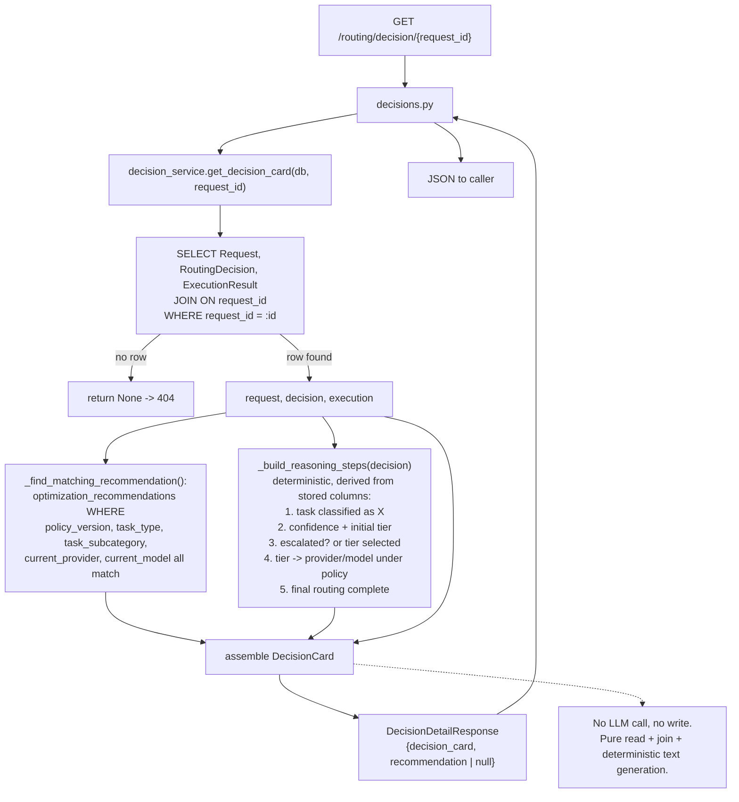

---

## 14. Agent Pipeline (`routing_agent.investigate()`)

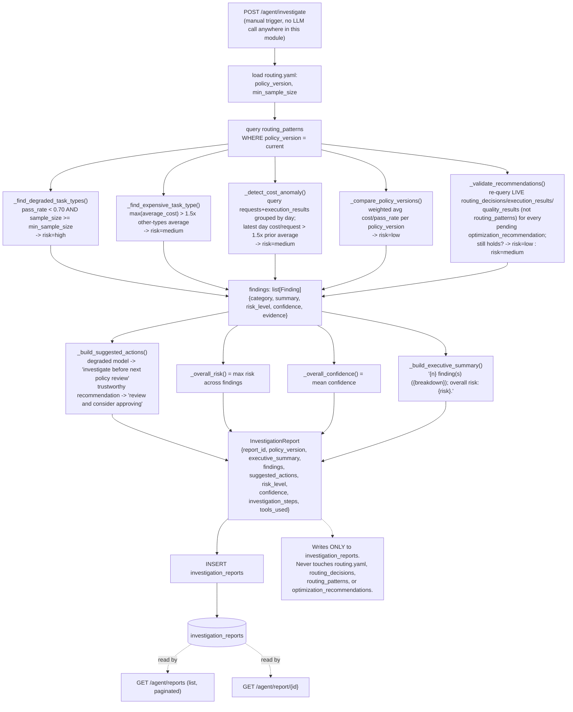

---

## 15. External Integrations

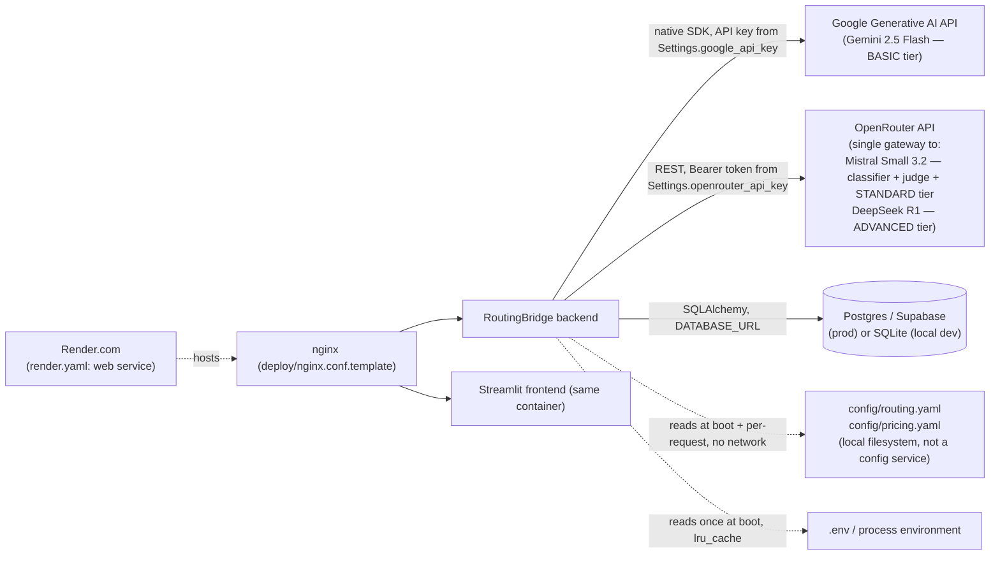

No object storage, no vector DB, no message queue, no cache layer (Redis/etc.), and no external auth provider exist in this codebase — confirmed by the absence of any such client/import across `backend/` and `requirements.txt`.

---

## 16. End-to-End Master Flow

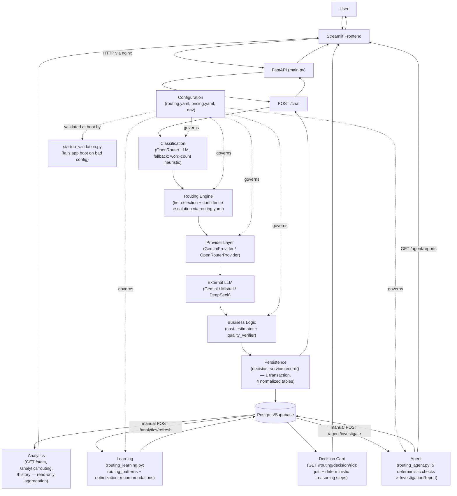

---

## Appendix: things this document deliberately does NOT show

Because they don't exist in the code (verified by reading every file, not inferred):

- PDF/document ingestion, chunking, embeddings, or a vector database
- A message queue, background job worker, or cron/scheduler (refresh and investigate are both synchronous, manually-triggered HTTP endpoints)
- A cache layer (Redis, in-memory TTL cache, etc.) — only `functools.lru_cache` on singleton service instances
- User authentication/authorization — every endpoint is unauthenticated
- Multi-tenancy — there is exactly one routing policy active at a time, globally
